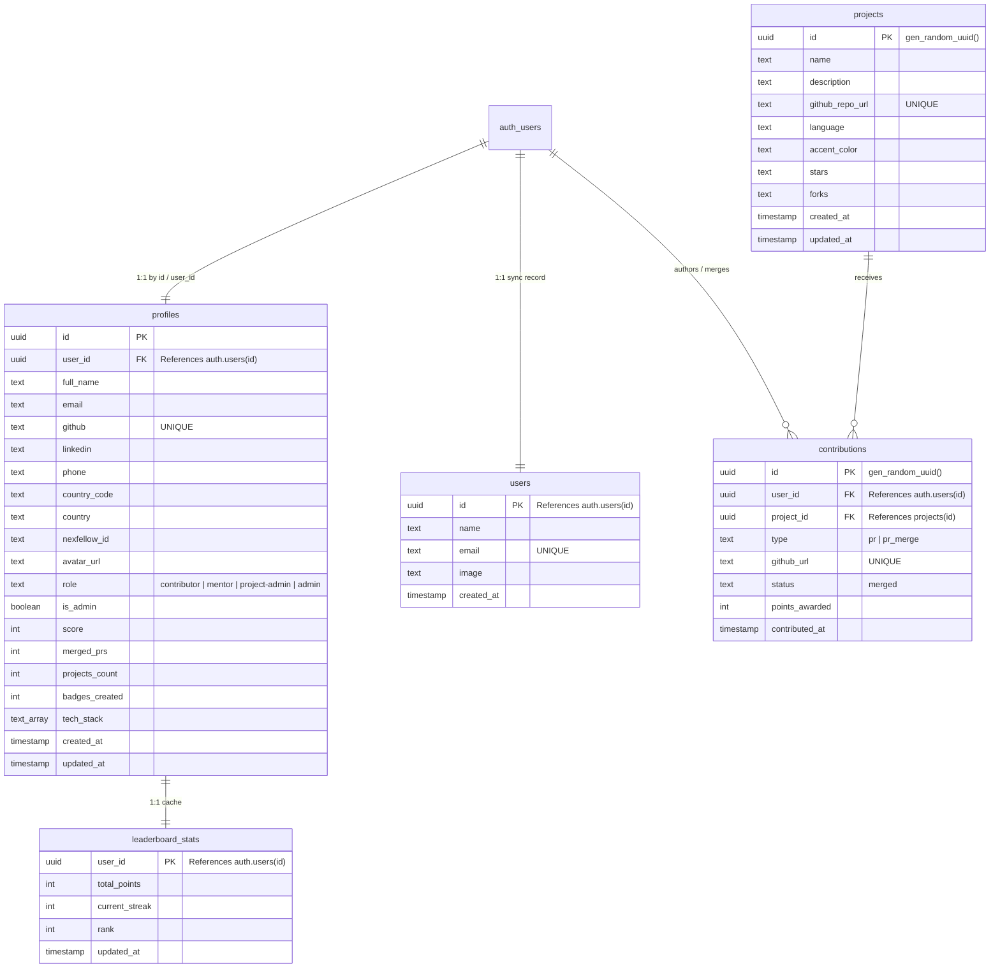

# Comprehensive Master Architecture & System Blueprint: OSC-India

> **Document Status**: Production Complete • 100% Codebase Coverage  
> **Target Project**: Open Source Connect India (OSC-India / OSCG 2026)  
> **Core Framework**: Next.js 15 (App Router, Server Actions, Route Handlers) + Supabase (Auth, PostgreSQL, Realtime CDC) + GitHub REST API  
> **Purpose**: This document serves as the **Master System Specification and Encyclopedia** for the entire OSC-India platform. It details all database tables, schemas, indexes, and triggers; catalogues every server action, helper, utility, and client function; documents all React components and pages; and charts every operational workflow from authentication and multi-token GitHub scraping to real-time leaderboard broadcasts, dynamic project administration, and high-resolution badge generation.

---

## Table of Contents

1. [High-Level System Architecture](#1-high-level-system-architecture)
2. [Complete Database Schema & Supabase Setup (PostgreSQL)](#2-complete-database-schema--supabase-setup-postgresql)
3. [Exhaustive Function-by-Function Catalog](#3-exhaustive-function-by-function-catalog)
   - [3.1 GitHub Contribution Engine (`lib/actions/github.ts`)](#31-github-contribution-engine-libactionsgithubts)
   - [3.2 Admin Command Center Actions (`lib/actions/admin.ts`)](#32-admin-command-center-actions-libactionsadmints)
   - [3.3 Dynamic Project Actions (`lib/actions/projects.ts`)](#33-dynamic-project-actions-libactionsprojectsts)
   - [3.4 GitHub Helpers & Difficulty Parsing (`lib/utils/github-helpers.ts`)](#34-github-helpers--difficulty-parsing-libutilsgithub-helpersts)
   - [3.5 Client-Side Authentication Utilities (`lib/auth/client.ts`)](#35-client-side-authentication-utilities-libauthclientts)
   - [3.6 Admin Session & Crypto Auth (`lib/auth/admin-auth.ts`)](#36-admin-session--crypto-auth-libauthadmin-authts)
   - [3.7 User Profile Synchronization (`lib/auth/syncProfile.ts`)](#37-user-profile-synchronization-libauthsyncprofilets)
   - [3.8 Supabase Client Constructors (`lib/supabase/`)](#38-supabase-client-constructors-libsupabase)
   - [3.9 Edge Rate-Limiting & Proxy (`proxy.ts`)](#39-edge-rate-limiting--proxy-proxyts)
   - [3.10 CLI & Operational Scripts (`scripts/`)](#310-cli--operational-scripts-scripts)
4. [Complete API Route Handlers Reference](#4-complete-api-route-handlers-reference)
5. [Complete Component & Page Catalog](#5-complete-component--page-catalog)
   - [5.1 Shared Navigation & Foundation Components](#51-shared-navigation--foundation-components)
   - [5.2 Landing Page Sections](#52-landing-page-sections)
   - [5.3 Contributor Dashboard Components](#53-contributor-dashboard-components)
   - [5.4 Real-time Leaderboard Component](#54-real-time-leaderboard-component)
   - [5.5 Admin Command Center Components](#55-admin-command-center-components)
   - [5.6 Badge Studio Components](#56-badge-studio-components)
   - [5.7 App Pages & Routes](#57-app-pages--routes)
6. [Core Operational Workflows (End-to-End Lifecycles)](#6-core-operational-workflows-end-to-end-lifecycles)
   - [Workflow 1: Dual Authentication & GitHub Account Linking](#workflow-1-dual-authentication--github-account-linking)
   - [Workflow 2: GitHub Contribution Scrape, Scoring & Linked Issue Inheritance](#workflow-2-github-contribution-scrape-scoring--linked-issue-inheritance)
   - [Workflow 3: Fast Full-Sweep Cron & Aggregation Engine](#workflow-3-fast-full-sweep-cron--aggregation-engine)
   - [Workflow 4: Real-time Leaderboard CDC Synchronization](#workflow-4-real-time-leaderboard-cdc-synchronization)
   - [Workflow 5: Role-Based Access Control & Admin Governance](#workflow-5-role-based-access-control--admin-governance)
   - [Workflow 6: Personalized Verification Badge Generation & Asset Proxy](#workflow-6-personalized-verification-badge-generation--asset-proxy)
   - [Workflow 7: Contribution Graph Scraping & Tech Stack Personalization](#workflow-7-contribution-graph-scraping--tech-stack-personalization)
   - [Workflow 8: Dynamic Project Registry & Repository Cache Invalidation](#workflow-8-dynamic-project-registry--repository-cache-invalidation)
7. [Environment Variables & Configuration Catalog](#7-environment-variables--configuration-catalog)
8. [Step-by-Step Implementation & Replication Guide](#8-step-by-step-implementation--replication-guide)
9. [Testing, Diagnostics & CLI Playbook](#9-testing-diagnostics--cli-playbook)

---

## 1. High-Level System Architecture

The OSC-India platform combines Next.js App Router (React Server Components + Client Components) with a scalable Supabase PostgreSQL backend and a high-throughput GitHub REST API ingestion pipeline.

```
                           +-------------------------------------+
                           |         Next.js Client (App)        |
                           |  (React Server / Client Components) |
                           +------------------+------------------+
                                              |
                     +------------------------+------------------------+
                     |                        |                        |
           [Browser Client]           [Server Client]         [Admin Client / Actions]
           Anon Key + RLS             Cookie-based SSR        Service Role Key (Bypasses RLS)
                     |                        |                        |
                     v                        v                        v
        +-----------------------------------------------------------------------------+
        |                         Edge Middleware & Proxy                             |
        |  - In-Memory Sliding-Window Rate Limiter (proxy.ts)                         |
        |  - Route Guards (/admin, /dashboard, /badge)                                |
        |  - HMAC-SHA256 Dedicated Admin Session Cookie Verification                  |
        +-------------------------------------+---------------------------------------+
                                              |
                                              v
        +-----------------------------------------------------------------------------+
        |                             Supabase Backend                                |
        |  - GoTrue Auth (Google OAuth, Google Identity Services GIS, GitHub OAuth)   |
        |  - PostgreSQL Tables: profiles, users, projects, contributions,             |
        |                       leaderboard_stats                                     |
        |  - Row Level Security (RLS) Policies                                        |
        |  - Database Triggers: handle_new_user() on auth.users                       |
        |  - Realtime CDC Broadcast: publication supabase_realtime                    |
        +-------------------------------------+---------------------------------------+
                                              |
                     +------------------------+------------------------+
                     |                                                 |
                     v                                                 v
        +----------------------------+                    +----------------------------+
        |      GitHub REST API       |                    |     Dynamic Project Store  |
        |  - Multi-Token Pool (1..5) |                    |  - public.projects (DB)    |
        |  - Repo-Centric Sweep      |                    |  - 17 Official Repos       |
        |  - Linked Issue Resolution |                    |  - Fallback JSON Cache     |
        |  - Rate-limit auto-switch  |                    |    (data/custom-projects)  |
        +----------------------------+                    +----------------------------+
```

### The Three Supabase Client Tiers

Security, cookie handling, and access levels are enforced through three distinct client initializations:

1. **Browser Client (`lib/supabase/client.ts`)**:
   - Instantiated with `createBrowserClient` from `@supabase/ssr` using `NEXT_PUBLIC_SUPABASE_URL` and `NEXT_PUBLIC_SUPABASE_ANON_KEY`.
   - Runs strictly in browser components. Subject to Row Level Security (RLS). Listens to auth state shifts and Supabase Realtime WebSocket events.
2. **Server Client (`lib/supabase/server.ts`)**:
   - Instantiated with `createServerClient` from `@supabase/ssr` using Next.js `cookies()`.
   - Runs in Server Components and Route Handlers. Reads and refreshes authenticated session tokens securely from HTTP-only cookies.
3. **Admin Client (`lib/supabase/admin.ts`)**:
   - Instantiated with `createClient` from `@supabase/supabase-js` using `SUPABASE_SERVICE_ROLE_KEY`.
   - **Bypasses Row Level Security (RLS)**.
   - Strictly reserved for server-side operations: background cron workers, score recalculation sweeps, user deletion purges, and administrative role updates.

---

## 2. Complete Database Schema & Supabase Setup (PostgreSQL)

The database schema is partitioned across five core tables to support high-speed querying for 10,000+ users.

### Entity Relationship Diagram (ERD)



### Consolidated SQL Migration Script

Run this unified script in Supabase's SQL Editor to stand up the entire database infrastructure:

```sql
-- ==============================================================================
-- 1. EXTENSIONS
-- ==============================================================================
CREATE EXTENSION IF NOT EXISTS "uuid-ossp";
CREATE EXTENSION IF NOT EXISTS "pgcrypto";

-- ==============================================================================
-- 2. CORE USERS TABLE (Optional Sync Table)
-- ==============================================================================
CREATE TABLE IF NOT EXISTS public.users (
  id UUID PRIMARY KEY REFERENCES auth.users(id) ON DELETE CASCADE,
  name TEXT,
  email TEXT UNIQUE,
  image TEXT,
  created_at TIMESTAMP WITH TIME ZONE DEFAULT timezone('utc'::text, now()) NOT NULL
);

-- ==============================================================================
-- 3. PROFILES TABLE (Canonical Contributor Profiles)
-- ==============================================================================
CREATE TABLE IF NOT EXISTS public.profiles (
  id UUID PRIMARY KEY REFERENCES auth.users(id) ON DELETE CASCADE,
  user_id UUID REFERENCES auth.users(id) ON DELETE CASCADE,
  full_name TEXT,
  email TEXT,
  github TEXT UNIQUE,
  linkedin TEXT,
  phone TEXT,
  country_code TEXT DEFAULT '+91',
  country TEXT DEFAULT 'IN',
  nexfellow_id TEXT,
  avatar_url TEXT,
  role TEXT DEFAULT 'contributor' CHECK (role IN ('contributor', 'mentor', 'project-admin', 'admin')),
  is_admin BOOLEAN DEFAULT FALSE,
  score INTEGER DEFAULT 0,
  merged_prs INTEGER DEFAULT 0,
  projects_count INTEGER DEFAULT 0,
  badges_created INTEGER DEFAULT 0,
  tech_stack TEXT[] DEFAULT '{}',
  created_at TIMESTAMP WITH TIME ZONE DEFAULT timezone('utc'::text, now()) NOT NULL,
  updated_at TIMESTAMP WITH TIME ZONE DEFAULT timezone('utc'::text, now()) NOT NULL
);

-- Ensure user_id backfilled for legacy rows
UPDATE public.profiles SET user_id = id WHERE user_id IS NULL;

-- 10k High-Performance Indexes
CREATE UNIQUE INDEX IF NOT EXISTS idx_profiles_user_id ON public.profiles (user_id);
CREATE INDEX IF NOT EXISTS idx_profiles_role ON public.profiles (role);
CREATE INDEX IF NOT EXISTS idx_profiles_score ON public.profiles (score DESC);
CREATE INDEX IF NOT EXISTS idx_profiles_github ON public.profiles (github);
CREATE INDEX IF NOT EXISTS idx_profiles_email ON public.profiles (email);
CREATE INDEX IF NOT EXISTS idx_profiles_score_prs ON public.profiles (score DESC, merged_prs DESC);

-- Partial Index: Only active contributors competing on the public leaderboard
CREATE INDEX IF NOT EXISTS idx_profiles_contributors_ranking 
  ON public.profiles (score DESC, merged_prs DESC) 
  WHERE role = 'contributor' AND is_admin = false;

-- ==============================================================================
-- 4. PROJECTS TABLE (Dynamic Repository Registry)
-- ==============================================================================
CREATE TABLE IF NOT EXISTS public.projects (
  id UUID DEFAULT gen_random_uuid() PRIMARY KEY,
  name TEXT NOT NULL,
  description TEXT,
  github_repo_url TEXT NOT NULL UNIQUE,
  language TEXT DEFAULT 'TypeScript',
  accent_color TEXT DEFAULT '#FF7518',
  stars TEXT DEFAULT '0',
  forks TEXT DEFAULT '0',
  created_at TIMESTAMP WITH TIME ZONE DEFAULT timezone('utc'::text, now()) NOT NULL,
  updated_at TIMESTAMP WITH TIME ZONE DEFAULT timezone('utc'::text, now()) NOT NULL
);

CREATE INDEX IF NOT EXISTS idx_projects_created_at ON public.projects (created_at DESC);

-- ==============================================================================
-- 5. CONTRIBUTIONS TABLE (Granular PR Tracking)
-- ==============================================================================
CREATE TABLE IF NOT EXISTS public.contributions (
  id UUID DEFAULT gen_random_uuid() PRIMARY KEY,
  user_id UUID REFERENCES auth.users(id) ON DELETE CASCADE,
  project_id UUID REFERENCES public.projects(id) ON DELETE CASCADE,
  type TEXT DEFAULT 'pr', -- 'pr' or 'pr_merge'
  github_url TEXT UNIQUE NOT NULL,
  status TEXT DEFAULT 'merged',
  points_awarded INTEGER DEFAULT 10,
  contributed_at TIMESTAMP WITH TIME ZONE DEFAULT timezone('utc'::text, now()) NOT NULL
);

CREATE INDEX IF NOT EXISTS idx_contributions_user_id ON public.contributions (user_id);
CREATE INDEX IF NOT EXISTS idx_contributions_project_id ON public.contributions (project_id);
CREATE INDEX IF NOT EXISTS idx_contributions_status_pts ON public.contributions (status, points_awarded);

-- ==============================================================================
-- 6. LEADERBOARD STATS TABLE (Aggregated High-Speed Cache)
-- ==============================================================================
CREATE TABLE IF NOT EXISTS public.leaderboard_stats (
  user_id UUID PRIMARY KEY REFERENCES auth.users(id) ON DELETE CASCADE,
  total_points INTEGER DEFAULT 0,
  current_streak INTEGER DEFAULT 1,
  rank INTEGER,
  updated_at TIMESTAMP WITH TIME ZONE DEFAULT timezone('utc'::text, now()) NOT NULL
);

CREATE INDEX IF NOT EXISTS idx_leaderboard_total_points ON public.leaderboard_stats (total_points DESC);

-- ==============================================================================
-- 7. ROW LEVEL SECURITY (RLS) POLICIES
-- ==============================================================================
ALTER TABLE public.profiles ENABLE ROW LEVEL SECURITY;
ALTER TABLE public.projects ENABLE ROW LEVEL SECURITY;
ALTER TABLE public.contributions ENABLE ROW LEVEL SECURITY;
ALTER TABLE public.leaderboard_stats ENABLE ROW LEVEL SECURITY;

-- Profiles Policies
DROP POLICY IF EXISTS "Public profiles are viewable by everyone" ON public.profiles;
CREATE POLICY "Public profiles are viewable by everyone" 
  ON public.profiles FOR SELECT USING (true);

DROP POLICY IF EXISTS "Users can insert their own profile" ON public.profiles;
CREATE POLICY "Users can insert their own profile" 
  ON public.profiles FOR INSERT WITH CHECK (auth.uid() = id OR auth.uid() = user_id);

DROP POLICY IF EXISTS "Users can update own profile" ON public.profiles;
CREATE POLICY "Users can update own profile" 
  ON public.profiles FOR UPDATE USING (auth.uid() = id OR auth.uid() = user_id);

-- Projects Policies
DROP POLICY IF EXISTS "Public can view projects" ON public.projects;
CREATE POLICY "Public can view projects" 
  ON public.projects FOR SELECT USING (true);

DROP POLICY IF EXISTS "Admins can manage projects" ON public.projects;
CREATE POLICY "Admins can manage projects" 
  ON public.projects FOR ALL USING (true) WITH CHECK (true);

-- Contributions & Leaderboard Stats Policies
DROP POLICY IF EXISTS "Public can view contributions" ON public.contributions;
CREATE POLICY "Public can view contributions" 
  ON public.contributions FOR SELECT USING (true);

DROP POLICY IF EXISTS "Public can view leaderboard stats" ON public.leaderboard_stats;
CREATE POLICY "Public can view leaderboard stats" 
  ON public.leaderboard_stats FOR SELECT USING (true);

-- ==============================================================================
-- 8. AUTH SIGNUP TRIGGER (Automatic Profile Provisioning)
-- ==============================================================================
CREATE OR REPLACE FUNCTION public.handle_new_user()
RETURNS TRIGGER AS $$
DECLARE
  extracted_github TEXT;
BEGIN
  extracted_github := COALESCE(
    new.raw_user_meta_data->>'user_name',
    new.raw_user_meta_data->>'preferred_username',
    NULL
  );

  INSERT INTO public.profiles (
    id, 
    user_id,
    full_name, 
    email, 
    avatar_url, 
    github, 
    role, 
    is_admin, 
    score, 
    merged_prs, 
    projects_count, 
    badges_created,
    tech_stack
  )
  VALUES (
    new.id,
    new.id,
    COALESCE(new.raw_user_meta_data->>'full_name', new.raw_user_meta_data->>'name', split_part(new.email, '@', 1)),
    new.email,
    COALESCE(new.raw_user_meta_data->>'avatar_url', new.raw_user_meta_data->>'picture', NULL),
    extracted_github,
    'contributor',
    FALSE,
    0,
    0,
    0,
    0,
    '{}'
  )
  ON CONFLICT (id) DO UPDATE SET
    user_id = EXCLUDED.user_id,
    full_name = EXCLUDED.full_name,
    email = EXCLUDED.email,
    avatar_url = COALESCE(public.profiles.avatar_url, EXCLUDED.avatar_url),
    github = COALESCE(public.profiles.github, EXCLUDED.github),
    updated_at = now();

  RETURN new;
END;
$$ LANGUAGE plpgsql SECURITY DEFINER;

DROP TRIGGER IF EXISTS on_auth_user_created ON auth.users;
CREATE TRIGGER on_auth_user_created
  AFTER INSERT ON auth.users
  FOR EACH ROW EXECUTE PROCEDURE public.handle_new_user();

-- ==============================================================================
-- 9. REALTIME PUBLICATION
-- ==============================================================================
DO $$
BEGIN
  IF NOT EXISTS (
    SELECT 1 FROM pg_publication_tables 
    WHERE pubname = 'supabase_realtime' 
    AND schemaname = 'public' 
    AND tablename = 'profiles'
  ) THEN
    ALTER PUBLICATION supabase_realtime ADD TABLE public.profiles;
  END IF;
END $$;
```

---

## 3. Exhaustive Function-by-Function Catalog

### 3.1 GitHub Contribution Engine (`lib/actions/github.ts`)

| Function Name | Parameters | Return Type | Description & Operational Logic |
|---|---|---|---|
| `getTokenPool` | *None* | `string[]` | Reads environment variables `GITHUB_ACCESS_TOKEN_1` through `_5` plus legacy `GITHUB_ACCESS_TOKEN` / `GITHUB_PAT`. Deduplicates tokens into a cached memory array. |
| `getGitHubAuthHeaders` | *None* | `Record<string, string>` | Increments module-level round-robin index across the token pool to yield an authorization header (`Bearer ${token}`). Falls back to HTTP Basic Auth if OAuth app credentials (`AUTH_GITHUB_ID` / `AUTH_GITHUB_SECRET`) are provided. |
| `syncGitHubContribution` | `userId: string, rawHandle: string, preFetchedAllowedSlugs?: Set<string>` | `Promise<SyncResult>` | **Single Contributor Ingestion**. Normalizes GitHub username. Exits early if role is admin/project-admin. Queries GitHub Search API for merged PRs bearing the official `OSCI'26` label. Chunks repositories in batches of 5 to avoid URL truncation. Resolves linked issues to inherit higher difficulty points. Updates `public.contributions`, `public.leaderboard_stats`, `public.profiles`, and `auth.users.user_metadata`. |
| `syncAllProjectsAndContributors` | *None* | `Promise<FullSyncResult>` | **Full-Sweep Recalculation Engine** (used in 6-hour cron & Admin bulk sync). Sweeps closed pull requests directly across all 17 competition repositories via the core GitHub REST API (5,000 req/hr quota). Tracks contributor PRs and project-admin mergers simultaneously. Executes 500-row chunked batch upserts into `contributions`, `leaderboard_stats`, and `profiles`. Updates top 50 active contributor auth metadata records. Completes in ~15-30s with `maxDuration = 300s`. |
| `registerPr` *(internal)* | `rawAuthor, repoSlug, prNumber, diff, htmlUrl, mergedAt` | `void` | Normalizes handle, filters out bot accounts, and accumulates PR records inside `contributorPrMap` ensuring unique PR deduplication. |
| `registerMerge` *(internal)* | `rawMerger, repoSlug, prNumber, htmlUrl, mergedAt` | `void` | Normalizes maintainer handle and registers merged competition PRs in `mergerMap` for project-admin point allocation. |
| `chunkedBatchUpsert` *(internal)* | `table: string, rows: unknown[], onConflict: string, chunkSize = 500` | `Promise<void>` | Slices arrays into 500-item chunks and executes concurrent upserts to eliminate database network overhead and round-trip bottlenecks. |

---

### 3.2 Admin Command Center Actions (`lib/actions/admin.ts`)

| Function Name | Parameters | Return Type | Description & Operational Logic |
|---|---|---|---|
| `requireSuperAdmin` | *None* | `Promise<{ user, profile }>` | Validates that caller possesses super-admin privileges. Accepts an HMAC-verified admin session cookie or an authenticated Supabase user whose role is `admin` or whose email matches `ADMIN_PORTAL_EMAIL`. Throws an error on unauthorized access. |
| `requireAdminOrProjectAdmin` | *None* | `Promise<{ user, profile }>` | Validates that caller is either a Super Admin or Project Admin. Enables Project Admins to execute point awards and single contributor syncs. |
| `getAdminData` | *None* | `Promise<{ profiles, metrics, projects }>` | Retrieves all profiles joined with `public.users(name, email, image, created_at)` ordered by score descending. Computes system-wide metrics (`totalUsers`, `contributors`, `mentors`, `projectAdmins`, `admins`, `totalPRs`, `totalScore`). Loads active projects from `getProjects()`. Falls back to `auth.admin.listUsers()` if the database is unpopulated. |
| `updateUserRole` | `targetUserId: string, newRole: "contributor" \| "mentor" \| "project-admin" \| "admin"` | `Promise<{ success: boolean; error?: string }>` | Modifies target user's role. **Rule**: If promoted out of contributor to admin, project-admin, or mentor, resets `score`, `merged_prs`, and `projects_count` to `0`. Updates both `auth.users.user_metadata` and `public.profiles`. Revalidates `/admin` and `/leaderboard`. |
| `updateUserScore` | `targetUserId: string, pointDelta: number, mode: "add" \| "set" = "add"` | `Promise<{ success: boolean; score?: number; error?: string }>` | Awards or resets merit points. **Rule 1**: Self-scoring is strictly rejected (`requester.id === targetUserId`). **Rule 2**: Points can only be awarded to users with role `contributor`. Updates database and auth metadata. Revalidates `/admin`, `/leaderboard`, and `/dashboard`. |
| `updateUserGithub` | `targetUserId: string, newGithub: string` | `Promise<{ success: boolean; github?: string; error?: string }>` | Manually corrects or updates a contributor's GitHub username directly from the admin table. Updates `auth.users` metadata and `public.profiles`. |
| `syncSingleUser` | `targetUserId: string, githubHandle: string` | `Promise<SyncResult>` | Admin-triggered manual sync for an individual contributor. Invokes `syncGitHubContribution` and revalidates cached routes. |
| `syncAllUsers` | *None* | `Promise<BulkSyncResult>` | Triggers `syncAllProjectsAndContributors()`. Executes full repo sweep across all 17 projects and syncs all contributors in high-speed batches. |
| `adminLoginAction` | `prevState: any, formData: FormData` | `Promise<{ success: boolean; error?: string }>` | Authenticates admin using email and master password. Calls `validateAdminCredentials()`. Upon success, sets the HMAC-SHA256 signed `osc_admin_session` cookie and revalidates `/admin`. |
| `adminLogoutAction` | *None* | `Promise<{ success: boolean }>` | Clears the `osc_admin_session` HTTP-only cookie and locks the command center immediately. |
| `deleteUserAction` | `targetUserId: string` | `Promise<{ success: boolean; error?: string }>` | Permanently purges a user. **Protections**: Blocks self-deletion; blocks deletion of the root super-admin (`ADMIN_PORTAL_EMAIL`). Sequentially deletes from `public.profiles`, `public.users`, `public.contributions`, `public.leaderboard_stats`, and `auth.users`. Also purges duplicate auth identities matching the target user's email. |

---

### 3.3 Dynamic Project Actions (`lib/actions/projects.ts`)

| Function Name | Parameters | Return Type | Description & Operational Logic |
|---|---|---|---|
| `readLocalCustomProjects` | *None* | `ProjectItem[]` | Reads and parses JSON array from `data/custom-projects.json`. Returns empty array if file is absent or malformed. |
| `writeLocalCustomProjects` | `projects: ProjectItem[]` | `void` | Writes projects array to `data/custom-projects.json`, creating parent directories recursively if necessary. |
| `checkAdminAuth` | *None* | `Promise<boolean>` | Helper that verifies whether the current caller holds an admin session cookie or Supabase profile role of `admin` or `project-admin`. |
| `parseProjectFromDb` | `row: DbProjectRow` | `ProjectItem` | Extracts project fields from DB record. Inspects `description` for an embedded `<!--meta:{...}-->` comment to parse extra attributes (language, accentColor, stars, forks) if present. |
| `getProjects` | *None* | `Promise<ProjectItem[]>` | Single source of truth for active projects. Queries `public.projects`. If reachable, synchronizes local cache via `writeLocalCustomProjects()` and returns results. Falls back to `readLocalCustomProjects()` and `DEFAULT_PROJECTS` (the 17 official repos) only on network/DB failure. |
| `invalidateSlugCache` | *None* | `Promise<void>` | Clears module-level `_slugCache` and resets timestamp to force fresh repo slug resolution on next sync. |
| `getDbAllowedRepoSlugs` | *None* | `Promise<Set<string>>` | Returns normalized lowercase `owner/repo` slugs for all competition repositories. Caches results in memory for 10 minutes (`SLUG_CACHE_TTL_MS = 600,000ms`). Always includes the 17 official competition slugs. |
| `createProjectAction` | `input: NewProjectInput` | `Promise<{ success, project?, error? }>` | Admin-only action to register a new repository. Normalizes GitHub URL, bundles metadata into description comment, inserts into `public.projects`, updates local JSON cache, invalidates slug cache, and revalidates `/projects` and `/admin`. |
| `deleteProjectAction` | `projectId: string` | `Promise<{ success, error? }>` | Admin-only action to delete a project. Purges linked contributions from `public.contributions` to satisfy foreign key constraints, deletes from `public.projects`, updates local cache, invalidates slug cache, and revalidates pages. |
| `deleteAllProjectsAction`| *None* | `Promise<{ success, count?, error? }>` | Super Admin emergency action. Deletes all contributions, deletes all rows from `public.projects`, clears local cache, invalidates slug cache, and revalidates `/projects` and `/admin`. |

---

### 3.4 GitHub Helpers & Difficulty Parsing (`lib/utils/github-helpers.ts`)

| Function / Constant | Type / Signature | Description & Operational Logic |
|---|---|---|
| `DIFFICULTY_POINTS` | `Record<DifficultyLevel, number>` | Point allocation map: `{ easy: 10, medium: 20, hard: 30, expert: 50 }`. |
| `MERGER_POINTS` | `number = 5` | Points awarded to Project Admins per merged `OSCI'26`-labelled PR. |
| `DIFFICULTY_RANK` | `Record<DifficultyLevel, number>` | Rank precedence hierarchy: `{ easy: 1, medium: 2, hard: 3, expert: 4 }`. |
| `OFFICIAL_COMPETITION_REPOS` | `readonly string[]` | Array of the 17 official competition repository URLs. |
| `OFFICIAL_COMPETITION_REPO_SLUGS` | `Set<string>` | Set of 17 normalized lowercase `owner/repo` slugs. |
| `isAllowedCompetitionRepo` | `(repoSlugOrUrl?: string \| null) => boolean` | Validates if a given URL or slug belongs to the official competition list. |
| `normalizeGitHubHandle` | `(handle: string) => string` | Strips leading `@`, protocol prefixes (`https://github.com/`), and trailing slashes to extract clean lowercase GitHub handle. |
| `detectDifficulty` | `(item: { title?, body?, labels? }) => DifficultyLevel` | Three-tier difficulty detector: (1) Official labels (highest priority), (2) Title bracketed tags like `[Hard]`, (3) Body text regex like `difficulty: expert`. Defaults to `"easy"`. |
| `extractLinkedIssueNumbers` | `(text?: string \| null) => number[]` | Uses regex `/(?:close[sd]?\|fix(?:e[sd])?\|resolve[sd]?)\s+#(\d+)/gi` to extract issue numbers referenced in PR titles and descriptions. |
| `extractRepoSlug` | `(urlOrSlug?: string \| null) => string \| null` | Robust parser supporting `api.github.com/repos/owner/repo`, `github.com/owner/repo`, PR URLs (`.../pull/123`), and raw `owner/repo` strings. |

---

### 3.5 Client-Side Authentication Utilities (`lib/auth/client.ts`)

| Function Name | Parameters | Return Type | Description & Operational Logic |
|---|---|---|---|
| `signInWithOAuth` | `provider: "github" \| "google", nextUrl = "/dashboard"` | `Promise<{ error?: string }>` | Initiates client-side OAuth redirect via Supabase GoTrue Auth. Configures scopes (`read:user user:email` for GitHub; `offline` access for Google). |
| `signInWithGoogleIdToken` | `idToken: string` | `Promise<{ error?: string }>` | Authenticates user directly using a Google Identity Services (GIS) ID Token. Supabase exchanges token in the background; triggers `/api/auth/sync` to provision profile seamlessly. |
| `linkGithubAccount` | `userId?: string` | `Promise<{ error?: string }>` | Links GitHub to an existing Google session. Sets `osc_linking_user_id` cookie before triggering GitHub OAuth redirect, preventing identity collisions in the callback. |
| `saveGithubUsername` | `username: string` | `Promise<{ error?: string }>` | Sends POST request to `/api/profile/github` to save a manually entered username. |
| `signOutClient` | `redirectTo = "/"` | `Promise<void>` | Signs out from Supabase client and redirects window to target URL. |
| `getClientUser` | *None* | `Promise<User \| null>` | Directly reads the current session user from Supabase client. |
| `getClientProfile` | *None* | `Promise<ClientProfilePayload \| null>` | Fetches user session and queries `public.profiles` (`user_id = user.id`). Resolves avatar from metadata, identities, or GitHub avatar fallback. |

---

### 3.6 Admin Session & Crypto Auth (`lib/auth/admin-auth.ts`)

| Function / Constant | Type / Signature | Description & Operational Logic |
|---|---|---|
| `ADMIN_COOKIE_NAME` | `"osc_admin_session"` | Name of the HTTP-only cookie storing the signed admin session token. |
| `SESSION_MAX_AGE_SECONDS` | `28800` (8 hours) | Maximum duration of an administrative session. |
| `validateAdminCredentials` | `(emailInput: string, passwordInput: string) => boolean` | Compares inputs against `ADMIN_PORTAL_EMAIL` and `ADMIN_PORTAL_PASSWORD`. Employs `crypto.timingSafeEqual` with dummy buffers to prevent timing side-channel attacks. |
| `createAdminToken` | `() => string` | Generates a `${timestamp}.${signature}` token signed with HMAC-SHA256 using `ADMIN_SESSION_SECRET`. |
| `verifyAdminToken` | `(token?: string \| null) => boolean` | Validates token structure, checks for expiration and clock drift (> 1 min into future), and verifies HMAC-SHA256 signature using `crypto.timingSafeEqual`. |
| `verifyAdminSession` | `() => Promise<boolean>` | Reads cookie from Next.js `cookies()` and passes value through `verifyAdminToken()`. |
| `setAdminSessionCookie` | `() => Promise<void>` | Sets `osc_admin_session` cookie with flags `httpOnly: true`, `sameSite: "lax"`, `path: "/"`, and `secure: true` in production. |
| `clearAdminSessionCookie`| `() => Promise<void>` | Deletes the `osc_admin_session` cookie from the client store. |

---

### 3.7 User Profile Synchronization (`lib/auth/syncProfile.ts`)

| Function Name | Parameters | Return Type | Description & Operational Logic |
|---|---|---|---|
| `getAppBaseUrl` | *None* | `string` | Resolves canonical application origin respecting `NEXT_PUBLIC_APP_URL`, `VERCEL_URL`, and `http://localhost:3000`. |
| `syncUserProfile` | `user: User` | `Promise<Profile>` | Provisions and reconciles user data across `public.users` and `public.profiles`. Matches by `user_id` first, then by GitHub handle. Merges metadata (name, avatar, github). Updates Supabase Auth metadata. Checks if last sync was > 30 minutes ago; if stale, asynchronously dispatches a background fetch to `/api/sync/background` without blocking the login response. |

---

### 3.8 Supabase Client Constructors (`lib/supabase/`)

- **`lib/supabase/client.ts`**: `createClient()` — Creates a browser client using `createBrowserClient(NEXT_PUBLIC_SUPABASE_URL, NEXT_PUBLIC_SUPABASE_ANON_KEY)`.
- **`lib/supabase/server.ts`**: `createClient()` — Creates an async server client using `createServerClient` with Next.js `cookies().getAll()` and `cookies().setAll()`.
- **`lib/supabase/admin.ts`**: `createAdminClient()` — Instantiates service-role admin client with `createClient(NEXT_PUBLIC_SUPABASE_URL, SUPABASE_SERVICE_ROLE_KEY)` with `persistSession: false`.
- **`lib/supabase/database.ts`**: Canonical TypeScript interface for `Profile`.

---

### 3.9 Edge Rate-Limiting & Proxy (`proxy.ts`)

- **`checkRateLimit(key: string, maxRequests: number, windowMs: number): boolean`**: In-memory sliding-window store using `Map<string, RateLimitEntry>`. Evicts expired keys when map size exceeds 5,000 entries. Returns `true` if request is allowed, `false` if limit exceeded.
- **`proxy(request: NextRequest): NextResponse`**: Intercepts requests matching configured routes:
  - `/api/auth/sync`: 10 requests / 60 seconds
  - `/api/profile/github`: 5 requests / 60 seconds
  - `/api/profile/tech-stack`: 10 requests / 60 seconds
  - `/api/github-activity`: 15 requests / 60 seconds
  - Returns `429 Too Many Requests` with a `Retry-After: 60` header when threshold is breached.

---

### 3.10 CLI & Operational Scripts (`scripts/`)

- **`scripts/debug-sync.ts`**:
  - Command: `npx tsx scripts/debug-sync.ts <github_username>`
  - Performs on-demand GitHub Search API inspection for an individual username. Outputs total PRs, tracked project matches, difficulty classification, linked issue inheritances, and resulting points.
- **`scripts/backfill-contributions-table.js`**:
  - Command: `node scripts/backfill-contributions-table.js`
  - Scans all 17 competition repositories, matches pull requests with registered contributor accounts, and batch upserts records directly into `public.contributions` and `public.leaderboard_stats`.
- **`scripts/backfill-and-scale-profiles.js`**:
  - Command: `node scripts/backfill-and-scale-profiles.js`
  - High-speed 10k scaling and recalculation engine. Fetches all pull requests across the 17 repos in parallel, lists all `auth.users`, handles duplicate GitHub accounts across emails, computes scores, upserts records in batches of 100 into `public.users` and `public.profiles`, and measures database query latency in milliseconds.

---

## 4. Complete API Route Handlers Reference

All route handlers are configured with `export const dynamic = "force-dynamic"`.

```
==================================================================================================
ENDPOINT                              METHOD   AUTH LEVEL        MAX DURATION  PURPOSE
==================================================================================================
/api/cron/sync-contributors           GET      CRON_SECRET       300s          6-Hour full sweep across 17 repos & contributors
/api/cron/sync-leaderboard            GET      CRON_SECRET       60s           2-Hour fast DB aggregation of contributions
/api/sync/background                  POST     CRON_SECRET       60s           Decoupled login sync worker (userId, github)
/api/auth/sync                        POST     User Session      --            Provisions profile on login via syncUserProfile
/api/profile/github                   POST     User Session      --            Links GitHub handle & triggers instant sync
/api/profile/tech-stack               POST     User Session      --            Saves user's top languages to profiles.tech_stack
/api/github-activity                  GET      Public            --            Scrapes GitHub contribution calendar HTML (1h cache)
/api/badge/increment                  POST     User Session      --            Enforces & increments badge counter (max 3)
/api/badge/proxy-image                GET      Public            --            Proxies external avatars with CORS headers for PNG export
/auth/callback                        GET      OAuth Provider    --            Exchanges OAuth code & resolves account linking
/auth/google                          GET      Public            --            Redirects to Google OAuth flow
/api/auth/google                      GET      Public            --            Google OAuth initiator endpoint
/api/auth/google/callback             GET      Public            --            Google OAuth callback handler
==================================================================================================
```

### Detailed Endpoint Specifications

#### 1. `GET /api/cron/sync-contributors`
- **Headers / Query**: `Authorization: Bearer <CRON_SECRET>` or `?secret=<CRON_SECRET>`.
- **Optional Params**: `?user_id=<UUID>&github=<handle>` to run an on-demand single user test.
- **Behavior**: Executes `syncAllProjectsAndContributors()`. Runs comprehensive REST API sweeps over all 17 competition repositories, calculates difficulty and maintainer merger points, and commits chunked batch updates to PostgreSQL.

#### 2. `GET /api/cron/sync-leaderboard`
- **Headers / Query**: `Authorization: Bearer <CRON_SECRET>` or `?secret=<CRON_SECRET>`.
- **Optional Params**: `?user_id=<UUID>&github=<handle>`.
- **Behavior**: Fast aggregation engine. Reads verified rows from `public.contributions` where `status = 'merged'`, aggregates points and unique projects per user, and updates `public.profiles` and `public.leaderboard_stats` in 500-item batches. **Zero external GitHub API consumption**.

#### 3. `POST /api/sync/background`
- **Headers**: `x-sync-secret: <CRON_SECRET>` (optional verification), `Content-Type: application/json`.
- **Body**: `{ "userId": "<UUID>", "github": "<handle>" }`.
- **Behavior**: Asynchronously invoked during user login to calculate and update PR contributions in the background without holding up the user's browser navigation.

#### 4. `POST /api/auth/sync`
- **Auth**: Authenticated Supabase session cookie.
- **Behavior**: Reads authenticated user, calls `syncUserProfile(user)`, reconciles database records, and returns `{ success: true, profile }`.

#### 5. `POST /api/profile/github`
- **Auth**: Authenticated Supabase session cookie.
- **Body**: `{ "github": "octocat" }`.
- **Behavior**: Normalizes handle, saves to `public.profiles`, synchronizes `auth.users.user_metadata`, and immediately triggers `syncGitHubContribution()` so new pull requests appear on the dashboard instantly.

#### 6. `POST /api/profile/tech-stack`
- **Auth**: Authenticated Supabase session cookie.
- **Body**: `{ "languages": ["TypeScript", "Python", "Rust"] }`.
- **Behavior**: Updates `profiles.tech_stack` array for the current user. Includes fallback handling for schemas where `updated_at` is managed by triggers.

#### 7. `GET /api/github-activity`
- **Query**: `?username=<github_handle>`.
- **Behavior**: Fetches GitHub profile contributions calendar at `https://github.com/users/<username>/contributions`. Regex-parses `data-date` and `<tool-tip>` elements into an array of `{ date: "YYYY-MM-DD", count: number }` objects. Cached server-side for 1 hour (`next: { revalidate: 3600 }`).

#### 8. `POST /api/badge/increment`
- **Auth**: Authenticated Supabase session cookie.
- **Behavior**: Verifies that `badges_created < 3`. If limit reached, returns `400 Bad Request`. Otherwise increments `badges_created` in `auth.users.user_metadata` and `public.profiles`, returning `{ success: true, count: newCount }`.

#### 9. `GET /api/badge/proxy-image`
- **Query**: `?url=<image_url>`.
- **Behavior**: Server-side image fetcher. Returns image stream with headers:
  - `Access-Control-Allow-Origin: *`
  - `Cache-Control: public, max-age=86400, stale-while-revalidate=43200`
  - Prevents canvas cross-origin taint errors during `html-to-image` client rendering.

#### 10. `GET /auth/callback`
- **Query**: `?code=<code>&next=/dashboard`.
- **Behavior**: Exchanges OAuth authorization code for session cookies. If `osc_linking_user_id` cookie is present, unlinks the handle from any secondary account, assigns it to the linking user's profile, unifies user records, triggers immediate GitHub contribution sync, and deletes the linking cookie before redirecting.

---

## 5. Complete Component & Page Catalog

### 5.1 Shared Navigation & Foundation Components

#### `Navbar` (`app/components/Navbar.tsx`)
- **Type**: Client Component (`"use client"`).
- **Props**: `{ initialProfile?: ClientProfilePayload | null }`.
- **State**: `mobileOpen` (drawer toggle), `scrolled` (background blur toggle), `profile` (cached profile data), `dropdownOpen` (profile menu toggle).
- **Features**:
  - Listens to `supabase.auth.onAuthStateChange` to transition UI between authenticated and unauthenticated states in real time.
  - Dynamically renders navigation links:
    - *Authenticated*: Dashboard, Leaderboard, Projects, Timeline.
    - *Unauthenticated*: About us, Projects, Timeline.
  - User profile dropdown with links to `/dashboard`, `/leaderboard`, `/badge`, and `Sign Out`.
  - Mobile responsive drawer menu with animated hamburger icon.
  - Responsive logo: desktop full banner (`/logo.png`) vs mobile emblem (`/mobile-logo.png`).

#### `Footer` (`app/components/Footer.tsx`)
- **Type**: Server / Client Component.
- **Features**: Multi-column footer displaying OSC-India branding, initiative description, quick links, event timeline links, legal/community guidelines, and social channel buttons.

---

### 5.2 Landing Page Sections

#### `HeroSection` (`app/components/HeroSection.tsx`)
- **Type**: Client Component (`"use client"`).
- **State**: `timeLeft` (`{ hours, minutes, seconds }`).
- **Features**:
  - Live countdown timer calculating interval to competition opening (`2026-09-01T09:00:00+05:30`).
  - Hero title with branded orange glow and cyberpunk gradient styling.
  - Primary call-to-action buttons directing users to `/sign-in` and `#projects`.
  - Integrated with desktop full-span backdrop (`/hero-bg-clean.png`) and mobile cyborg backdrop (`/hero-mobile-bg.png`).

#### `StatsSection` (`app/components/StatsSection.tsx`)
- **Type**: Server Component.
- **Features**: Displays key program metrics (17+ competition projects, 600+ contributors, 30+ mentors, nationwide scope). Highlights community mission and developer empowerment goals.

#### `ContributeSection` (`app/components/ContributeSection.tsx`)
- **Type**: Server Component.
- **Features**: Step-by-step 3-stage visual guide: (1) Find a Project, (2) Pick an Issue, (3) Submit Pull Request with `OSCI'26` label.

#### `WhatsNewSection` (`app/components/WhatsNewSection.tsx`)
- **Type**: Server Component.
- **Features**: Live updates, featured workshops, community milestones, and spotlight notices.

#### `ProjectsSection` (`app/components/ProjectsSection.tsx`)
- **Type**: Server Component.
- **Features**: Renders featured projects from the official repository registry with direct links to `/projects`.

#### `ProjectCard` (`app/components/ProjectCard.tsx`)
- **Type**: Client Component.
- **Props**: `{ title: string; description: string; language: string; stars: string; forks: string; githubUrl: string; accentColor: string }`.
- **Features**: Interactive card with custom border hover gradients, language tag pill, GitHub stars and forks counters, and direct repo links.

#### `SponsorsSection` (`app/components/SponsorsSection.tsx`)
- **Type**: Server Component.
- **Features**: Platinum, Gold, and Silver partner grids showcasing official ecosystem sponsors: **TruScholar**, **NexFellow**, and **Sylus**.

#### `TeamCard` (`app/components/TeamCard.tsx`)
- **Type**: Client Component.
- **Props**: `{ name: string; role: string; linkedinUrl: string }`.
- **Features**: Team profile card with avatar initials fallback and LinkedIn profile link.

---

### 5.3 Contributor Dashboard Components

#### `ActivityMatrix` (`app/components/ActivityMatrix.tsx`)
- **Type**: Client Component (`"use client"`).
- **Props**: `{ providerAccountId: string | null }`.
- **State**: `contributions` (calendar data), `isSyncing` (loading indicator), `error` (error message), `customHandle` (manual input).
- **Features**:
  - Full 52-week contribution heatmap rendering every day of the past year.
  - Caches contribution data in `localStorage` with a 1-hour TTL (`CACHE_TTL_MS = 3,600,000ms`).
  - Calls `/api/github-activity?username=...` to scrape GitHub calendar data.
  - Formats local dates without UTC timezone shifts (`formatLocalDate`).
  - Renders 5 green intensity tiers for 0, 1-3, 4-6, 7-9, and 10+ contributions.
  - Displays day-of-week labels and month headers with tooltip date and count details.

#### `TechStack` (`app/components/TechStack.tsx`)
- **Type**: Client Component (`"use client"`).
- **Props**: `{ initialStack: string[]; providerAccountId: string | null }`.
- **State**: `stack` (array of languages), `isSyncing` (loading indicator), `error` (error message).
- **Features**:
  - Queries user's public repositories via GitHub REST API (`/users/${username}/repos`).
  - Aggregates language occurrences, sorts by frequency, and selects the top 5 languages.
  - Automatically saves the top 5 stack to Supabase via `/api/profile/tech-stack`.
  - Displays interactive language badges with sync refresh trigger.

#### `GitHubLinkCard` (`app/components/GitHubLinkCard.tsx`)
- **Type**: Client Component (`"use client"`).
- **Props**: `{ userId?: string }`.
- **State**: `isLoading` (spinner toggle), `error` (error display).
- **Features**: High-visibility banner displayed on `/dashboard` when a user signed in via Google but hasn't linked GitHub. Fires `linkGithubAccount(userId)` to establish verified connection.

---

### 5.4 Real-time Leaderboard Component

#### `LeaderboardUI` (`app/leaderboard/LeaderboardUI.tsx`)
- **Type**: Client Component (`"use client"`).
- **Props**:
  - `initialUsers: LeaderboardUser[]`
  - `initialProfile?: ClientProfilePayload | null`
  - `initialSearch?: string`
  - `currentPage?: number`
  - `totalPages?: number`
  - `totalCount?: number`
- **State**: `searchQuery`, `users`, `isLiveConnected`.
- **Features**:
  - **Top 3 Podium**:
    - Rank 1: Center, Gold crown, gold border glow.
    - Rank 2: Left, Silver wreath, silver border.
    - Rank 3: Right, Bronze wreath, bronze border.
  - **Rankings Table**: Ranks 4+, showing rank number, contributor name, `@username`, country flag (ISO-2 code), PR count, project count, and total score.
  - **Debounced Search**: 300ms debounce syncing query parameter `?q=...` with server pagination.
  - **Supabase Realtime Channel**: Subscribes to `leaderboard_feed` on `public.profiles`. Triggers automatic `router.refresh()` whenever points are updated anywhere in the system.
  - **Pagination Controls**: Previous, page indicator, Next buttons respecting `totalPages`.

---

### 5.5 Admin Command Center Components

#### `AdminLoginView` (`app/admin/AdminLoginView.tsx`)
- **Type**: Client Component (`"use client"`).
- **State**: `showPassword` (toggle), `errorMessage` (alert text), `isPending` (useTransition state).
- **Features**:
  - Cyberpunk-styled restricted entry portal with ambient orange glow.
  - Submits credentials to `adminLoginAction()`.
  - Displays real-time loading feedback and handles invalid credentials gracefully.

#### `AdminUI` (`app/admin/AdminUI.tsx`)
- **Type**: Client Component (`"use client"`).
- **Props**:
  - `initialProfiles: Profile[]`
  - `initialMetrics: { totalUsers, contributors, mentors, projectAdmins, admins, totalPRs, totalScore }`
  - `initialProjects: ProjectItem[]`
- **Features**:
  - **Metrics Bar**: 7 real-time cards detailing users, roles, total PRs, and aggregate platform score.
  - **Live User Management**:
    - Search by name, email, or GitHub handle.
    - Filter by role (`All`, `Contributor`, `Mentor`, `Project Admin`, `Admin`).
    - Inline Role Modifier: Prompts confirmation, executes `updateUserRole()`, auto-resets scores for non-contributors.
    - Inline Score Adjuster: Quick delta buttons (`+10`, `+20`, `+50`, `+100`, `Reset`).
    - Inline GitHub Editor: Manually modifies contributor username via `updateUserGithub()`.
    - Single User Sync: Refresh button triggering on-demand `syncSingleUser()`.
    - Delete User Modal: Requires typing `"DELETE"`; purges all linked records via `deleteUserAction()`.
  - **Project Management Center**:
    - Modal form to register new repositories via `createProjectAction()` (title, repo URL, language, accent color, stars, forks, description).
    - Delete project button with confirmation (`deleteProjectAction()`).
    - Emergency "Delete All Projects" button (`deleteAllProjectsAction()`).
  - **Data Export**: Generates and downloads full CSV snapshot of all registered contributors, handles, emails, and verified points.
  - **Global Recalculation**: "Sync All Users" button executing `syncAllUsers()` with real-time duration feedback.

---

### 5.6 Badge Studio Components

#### `BadgeClient` (`app/badge/BadgeClient.tsx`)
- **Type**: Client Component (`"use client"`).
- **Props**: `{ userId: string; initialRole: string; initialName: string; initialAvatar: string; initialBadgesCreated: number }`.
- **State**: Name, role, handle, avatar image, zoom scale (0.5x to 3x), position X/Y offsets, rotation (-180° to 180°), badges created counter.
- **Features**:
  - Theme switching: Obsidian & Electric Orange (Contributor) vs Royal Amethyst & Gold (Mentor).
  - High-precision Ashoka Chakra 24-spoke vector geometry (`AshokaChakraIcon` with exact mathematical coordinate spokes).
  - Holographic security chip overlay and barcode simulation.
  - Dual sponsor logos footer (NexFellow & TruScholar).
  - Drag-and-drop avatar file uploader with instant client image preview.
  - Sliders for pan, zoom, and rotation with one-click reset.
  - Account limit verification: Disables generation if `badgesCreated >= 3`.
  - Calls `/api/badge/increment` before generating image.
  - Uses `html-to-image` (`toPng` at 3x pixel ratio) to export high-definition 300 DPI PNG cards.

---

### 5.7 App Pages & Routes

| Route | File Path | Dynamic / Static | Description |
|---|---|---|---|
| `/` | `app/page.tsx` | Static / Revalidated | Homepage featuring hero banner, stats, 3-step guide, announcements, project carousel, sponsors, and footer. |
| `/dashboard` | `app/dashboard/page.tsx` | `force-dynamic` | Contributor dashboard showing total score, verified merged PR list with difficulty tags, GitHub link banner, activity matrix, and tech stack. |
| `/leaderboard`| `app/leaderboard/page.tsx` | `force-dynamic` | Server-rendered paginated leaderboard (50/page) with Top 3 Podium and real-time CDC updates. |
| `/projects` | `app/projects/page.tsx` | `force-dynamic` | Dynamic repository catalog fetching projects directly from `public.projects` via `getProjects()`. |
| `/admin` | `app/admin/page.tsx` | `force-dynamic` | Verifies `verifyAdminSession()`. Renders `AdminLoginView` if unauthenticated, or `AdminUI` Command Center if authenticated. |
| `/badge` | `app/badge/page.tsx` | `force-dynamic` | Loads user profile and passes initial state into `BadgeClient` studio. Redirects to `/sign-in` if unauthenticated. |
| `/timeline` | `app/timeline/page.tsx` | Static / Client | Phase-by-phase roadmap (Registrations, Mentors, Project Admins, Community Period, Mid-Eval, Grand Finale) with status filtering. |
| `/about` | `app/about/page.tsx` | Static / Client | Mission statement, "Why We Exist", and "Our Vision" narrative cards. |
| `/team` | `app/team/page.tsx` | Static / Client | Grid of 18 core community leads, organizers, and maintainers. |
| `/sign-in` | `app/sign-in/page.tsx` | Client Component | Sign-in interface supporting Google GIS One-Tap, Google OAuth, and GitHub OAuth. |
| `/sign-up` | `app/sign-up/page.tsx` | Client Component | Contributor registration landing. |

---

## 6. Core Operational Workflows (End-to-End Lifecycles)

### Workflow 1: Dual Authentication & GitHub Account Linking

```
               [Google Sign-In]                         [GitHub Sign-In]
                      │                                        │
                      ▼                                        ▼
          Google GIS / OAuth Callback               GitHub OAuth Callback
                      │                                        │
                      ▼                                        ▼
            syncUserProfile(user)                   /auth/callback/route.ts
                      │                                        │
            User profile created                        Is linking cookie
            in public.profiles?                     (osc_linking_user_id) set?
                      │                                  ├── YES: Link GitHub to
                      ▼                                  │        original Google user,
          Wants to connect GitHub?                       │        deduplicate & sync
                      │                                  └── NO:  Standard profile
                      ▼                                           creation & login
            Fires linkGithubAccount()
            Sets cookie: osc_linking_user_id
            Redirects to GitHub OAuth
```

1. **Initial Login**: Contributor signs in using Google One-Tap or GitHub OAuth. `syncUserProfile` ensures a row exists in `public.profiles` and `public.users`.
2. **Account Linking**: If the user signed in with Google, `/dashboard` displays `GitHubLinkCard`. Clicking "Connect GitHub" triggers `linkGithubAccount()`, setting an `osc_linking_user_id` cookie before redirecting to GitHub OAuth.
3. **Reconciliation**: In `app/auth/callback/route.ts`, if `osc_linking_user_id` is detected, the server updates the Google user's profile with the GitHub handle, unlinks any stale duplicate accounts holding that handle, fires an immediate contribution sync, deletes the linking cookie, and redirects to `/dashboard?linked=github`.

---

### Workflow 2: GitHub Contribution Scrape, Scoring & Linked Issue Inheritance

```
syncGitHubContribution(userId, handle)
  │
  ├─► 1. Check Role: If role !== 'contributor' -> Exit early
  ├─► 2. Load Allowed Repositories: getDbAllowedRepoSlugs() -> 17 official repos
  ├─► 3. Chunk repos into groups of 5 to avoid GitHub Search API URL length truncation
  ├─► 4. Query GitHub Search API:
  │      author:{handle} type:pr is:merged label:"OSCI'26" repo:...
  ├─► 5. For each merged PR:
  │      ├── Detect base difficulty from PR labels/title/body
  │      ├── Parse linked issue numbers (e.g. "Fixes #45")
  │      ├── Fetch linked issue via core REST API
  │      └── If issue difficulty > PR difficulty -> INHERIT higher difficulty!
  ├─► 6. Sum total points: (easy * 10) + (med * 20) + (hard * 30) + (exp * 50)
  ├─► 7. Batch upsert into public.contributions (onConflict: "github_url")
  ├─► 8. Upsert into public.leaderboard_stats (onConflict: "user_id")
  └─► 9. Update public.profiles (score, merged_prs, projects_count, updated_at)
```

---

### Workflow 3: Fast Full-Sweep Cron & Aggregation Engine

```
GitHub Actions (.github/workflows/cron-sync.yml) / Vercel Cron (vercel.json)
  │
  ├── Every 2 Hours: GET /api/cron/sync-leaderboard
  │     │
  │     ├─► Reads all rows from public.contributions (status = 'merged')
  │     ├─► Aggregates total points and projects per user in memory
  │     ├─► Chunked batch upserts (500 rows/batch) into public.leaderboard_stats
  │     ├─► Chunked batch upserts (500 rows/batch) into public.profiles
  │     └─► Zero GitHub API calls consumed! Takes ~2-3 seconds.
  │
  └── Every 6 Hours: GET /api/cron/sync-contributors
        │
        ├─► Executes syncAllProjectsAndContributors()
        ├─► Parallel REST sweeps over all 17 competition repositories
        ├─► Detects PR difficulty and counts maintainer merges (5 pts / merge)
        ├─► Chunked batch upserts into contributions, leaderboard_stats, profiles
        └─► Updates top 50 active contributor auth metadata records
```

---

### Workflow 4: Real-time Leaderboard CDC Synchronization

1. When a contributor's PR is merged or an admin adjusts points, `public.profiles` is updated in PostgreSQL.
2. PostgreSQL Change Data Capture (CDC) emits an event to the `supabase_realtime` publication.
3. Connected client browsers subscribed via `supabase.channel("leaderboard_feed")` receive the WebSocket broadcast.
4. The client's `on("postgres_changes")` callback fires `router.refresh()`, triggering a background Server Component re-render that streams updated rankings to the UI without a full page reload.

---

### Workflow 5: Role-Based Access Control & Admin Governance

```
                                    User Role
                                        │
        ┌───────────────────┬───────────┴───────────┬───────────────────┐
        ▼                   ▼                       ▼                   ▼
   Contributor           Mentor               Project Admin           Admin
  - Submits PRs       - Mentorship         - Manages Repos         - Full Command Center
  - Earns Points      - Custom Badge       - Earns 5pts / Merge    - User & Project CRUD
  - Appears on          (Gold Theme)       - Scoring Console       - Bulk Sync & CSV
    Leaderboard       - Excluded from      - Excluded from         - Excluded from
                        Leaderboard          Leaderboard             Leaderboard
```

- **Promotion Safeguard**: Promoting a user to `admin`, `project-admin`, or `mentor` resets their `score`, `merged_prs`, and `projects_count` to `0`.
- **Anti-Self-Scoring**: `updateUserScore()` strictly forbids `requester.id === targetUserId`.
- **Root Admin Lock**: The root administrator account (`ADMIN_PORTAL_EMAIL`) cannot be deleted or modified by any other admin.

---

### Workflow 6: Personalized Verification Badge Generation & Asset Proxy

1. User visits `/badge`. Server verifies session and loads profile data.
2. User uploads an avatar, configures pan/zoom/rotation transforms, and toggles theme.
3. External avatar image URLs are routed through `/api/badge/proxy-image?url=...`, returning standard `Access-Control-Allow-Origin: *` headers.
4. User clicks "Download Verification Card". Client calls `/api/badge/increment`.
5. Server verifies `badges_created < 3`. If valid, increments count and returns success.
6. Client invokes `html-to-image` (`toPng` at 3x scale) to render the canvas DOM node into a 300 DPI PNG file named `OSCG2026_Badge_<Name>.png`.

---

### Workflow 7: Contribution Graph Scraping & Tech Stack Personalization

1. `/dashboard` renders `ActivityMatrix` and `TechStack`.
2. **Activity Heatmap**: Client checks `localStorage` for cached activity. If missing or expired (> 1 hour), calls `/api/github-activity?username=...`. The server scrapes GitHub's calendar HTML, parses contribution counts per date, and caches the response for 1 hour.
3. **Tech Stack**: Client calls GitHub's public API to fetch the user's public repos (`/users/${username}/repos`), calculates the top 5 languages, and dispatches a POST to `/api/profile/tech-stack` to store them in `profiles.tech_stack`.

---

### Workflow 8: Dynamic Project Registry & Repository Cache Invalidation

1. Admin accesses the Project Management modal in `/admin`.
2. Admin inputs repo details (Title, GitHub URL, Language, Accent Color, Stars, Forks, Description).
3. `createProjectAction()` inserts the record into `public.projects` and updates the backup cache at `data/custom-projects.json`.
4. The action calls `invalidateSlugCache()`, wiping the module-level `_slugCache` so that the sync engine immediately recognizes PRs submitted to the newly added repository.
5. Revalidates `/projects` and `/admin` paths.

---

## 7. Environment Variables & Configuration Catalog

Create `.env.local` with the following variables:

```bash
# ==============================================================================
# 1. SUPABASE CREDENTIALS (Required)
# ==============================================================================
NEXT_PUBLIC_SUPABASE_URL=https://your-project-ref.supabase.co
NEXT_PUBLIC_SUPABASE_ANON_KEY=eyJhbGciOiJIUzI1NiIsInR5cCI6IkpXVCJ9...
SUPABASE_SERVICE_ROLE_KEY=eyJhbGciOiJIUzI1NiIsInR5cCI6IkpXVCJ9...

# ==============================================================================
# 2. GITHUB MULTI-TOKEN ROTATION POOL (Required for High-Scale Sync)
# ==============================================================================
# Distributes REST API queries across multiple PATs (5,000 req/hr per token)
GITHUB_ACCESS_TOKEN_1=ghp_tokenAlpha123456789...
GITHUB_ACCESS_TOKEN_2=ghp_tokenBeta123456789...
GITHUB_ACCESS_TOKEN_3=ghp_tokenGamma123456789...
GITHUB_ACCESS_TOKEN_4=ghp_tokenDelta123456789...
GITHUB_ACCESS_TOKEN_5=ghp_tokenEpsilon123456789...

# Legacy Token Fallback
GITHUB_ACCESS_TOKEN=ghp_defaultTokenHere...
GITHUB_PAT=ghp_defaultTokenHere...

# GitHub OAuth App Credentials (Optional Fallback for Basic Auth)
AUTH_GITHUB_ID=your_oauth_app_client_id
AUTH_GITHUB_SECRET=your_oauth_app_client_secret

# ==============================================================================
# 3. GOOGLE IDENTITY SERVICES & OAUTH (Required for Google Sign-In)
# ==============================================================================
NEXT_PUBLIC_GOOGLE_CLIENT_ID=your_google_oauth_client_id.apps.googleusercontent.com

# ==============================================================================
# 4. ADMIN COMMAND CENTER CREDENTIALS (Required for /admin)
# ==============================================================================
ADMIN_PORTAL_EMAIL=sayanghosh1887@gmail.com
ADMIN_PORTAL_PASSWORD=Admin@OSC2026!
ADMIN_SESSION_SECRET=secure_random_hmac_secret_key_minimum_32_characters_long

# ==============================================================================
# 5. BACKGROUND CRON & WORKER AUTHENTICATION (Required)
# ==============================================================================
CRON_SECRET=your_secure_cron_webhook_secret_here

# ==============================================================================
# 6. APPLICATION CONFIGURATION
# ==============================================================================
NEXT_PUBLIC_APP_URL=http://localhost:3000
VERCEL_URL=osc-india.vercel.app
```

---

## 8. Step-by-Step Implementation & Replication Guide

To replicate this exact architecture in any new Next.js project:

### Step 1: Initialize Project & Install Dependencies
```bash
npx create-next-app@latest my-osc-app --typescript --tailwind --eslint --app
cd my-osc-app
npm install @supabase/supabase-js @supabase/ssr lucide-react sonner html-to-image
npm install -D tsx
```

### Step 2: Database Initialization
1. Create a project on [supabase.com](https://supabase.com).
2. Navigate to **SQL Editor** and run the consolidated migration script from **Section 2**.
3. Run `supabase/seed_projects.sql` to populate the 17 official competition repositories.
4. In **Authentication -> Providers**:
   - Enable **Google** and **GitHub**.
   - Add `https://your-domain.com/auth/callback` to the list of allowed Redirect URIs.

### Step 3: Implement Foundation Utilities
1. Copy `lib/supabase/` (`client.ts`, `server.ts`, `admin.ts`, `database.ts`).
2. Copy `lib/utils/github-helpers.ts`.
3. Copy `lib/auth/admin-auth.ts` and `lib/auth/syncProfile.ts`.
4. Copy `proxy.ts` to enforce rate-limiting.

### Step 4: Implement Server Actions & API Handlers
1. Copy `lib/actions/github.ts`, `lib/actions/admin.ts`, and `lib/actions/projects.ts`.
2. Copy all route handlers under `app/api/` and `app/auth/`.

### Step 5: Implement UI Components & Pages
1. Copy components from `app/components/` (`Navbar`, `Footer`, `ActivityMatrix`, `TechStack`, `GitHubLinkCard`, etc.).
2. Copy feature views: `app/admin/`, `app/leaderboard/`, `app/badge/`, `app/dashboard/`, and `app/projects/`.

### Step 6: Configure Automated Background Crons
1. Add `.github/workflows/cron-sync.yml` to trigger the 2-hour and 6-hour sync endpoints.
2. In GitHub repository settings, add secrets `APP_URL` and `CRON_SECRET`.
3. Add `vercel.json` for platform-level fallback cron scheduling.

---

## 9. Testing, Diagnostics & CLI Playbook

### 1. Test Single Contributor Sync via CLI
Inspect GitHub Search API parsing, difficulty detection, and points calculation for any handle:
```bash
npx tsx scripts/debug-sync.ts <github_username>
```

### 2. Run Full 10k Database Sweep & Recalculation Engine
Recalculate scores for all registered contributors across all 17 repositories:
```bash
node scripts/backfill-and-scale-profiles.js
```
*Expected Output*: Displays progress per repository, lists registered contributors from `auth.users`, runs batch upserts into `public.users` and `public.profiles`, and outputs database benchmark latency.

### 3. Backfill Contributions Table
Populate granular PR records into `public.contributions`:
```bash
node scripts/backfill-contributions-table.js
```

### 4. Admin Portal Diagnostics
1. Visit `http://localhost:3000/admin`.
2. Verify that `AdminLoginView` appears. Enter `ADMIN_PORTAL_EMAIL` and `ADMIN_PORTAL_PASSWORD`.
3. Confirm that the command center loads with metrics, user table, role modifiers, and project managers.
4. Verify that attempting to award points to oneself is rejected with `"Self-scoring is strictly prohibited."`

### 5. Real-time Leaderboard Verification
1. Open `/leaderboard` in Browser Window A.
2. In Browser Window B, visit `/admin` and adjust a contributor's score.
3. Observe that Browser Window A automatically updates rank and score via Supabase Realtime without manual reload.

### 6. Badge Studio Limit Test
1. Visit `/badge`. Customize personal ID card and click "Download Verification Card".
2. Confirm that badge count increments to `1/3`.
3. Repeat until count reaches `3/3`. Verify that download is disabled and further increment requests return `400 Limit Reached`.
